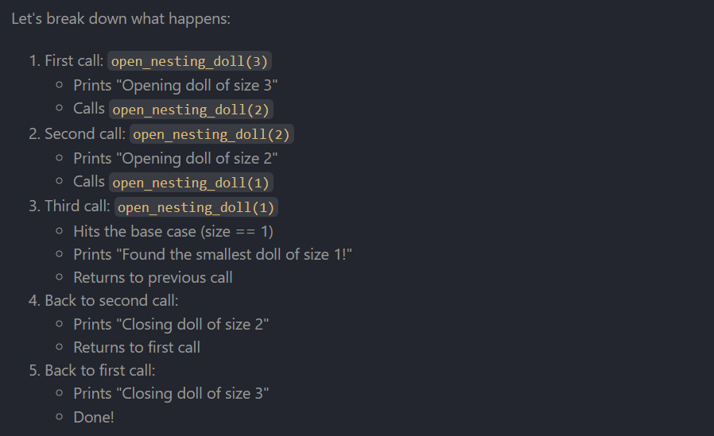
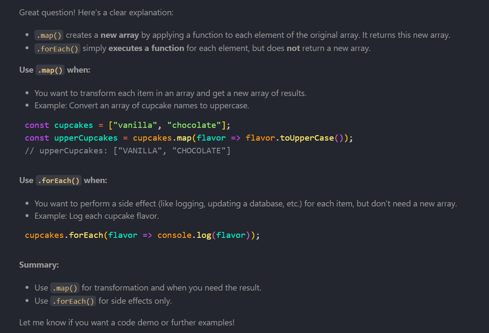

# 👩‍🏫 Copilot as a Teacher

Welcome to the classroom of Code without Barriers   🧑‍💻🔥

👩In this section, we’ll explore how GitHub Copilot can be your **coding teacher**, helping you learn new concepts, understand syntax, and build confidence in your skills.

---

## 💻 What does it mean for Copilot to be a teacher? 🧑‍🔬

Think of Copilot like a friendly tutor who:
- Explains things when you ask
- Shows examples when you're stuck
- Offers suggestions that help you learn—not skip steps

Copilot is great at **responding to curiosity**. The more questions you ask, the more you learn.

---

## 🧮 Learning Through Comments

One of the best ways to use Copilot as a teacher is by writing comments that ask questions or describe what you want to learn.

### Example 1: Ask for an explanation
```python
# What does this function do?
def bake(cupcakes):
    return sorted(cupcakes)
```

Copilot will often respond with a comment or rewrite that explains the logic.  

You can also ask:
```python
# Explain recursion with a simple example
```

This prompts Copilot to generate a teaching snippet—like a mini tutorial!


```python
def open_nesting_doll(size):
    # Base case: smallest doll (stops recursion)
    if size == 1:
        print(f"Found the smallest doll of size {size}!")
        return
    
    # Recursive case: open current doll and look inside
    print(f"Opening doll of size {size}")
    open_nesting_doll(size - 1)  # Call the same function with a smaller size
    print(f"Closing doll of size {size}")

# Try it with 3 nested dolls
open_nesting_doll(3)
```
When you run this code, it will output:
```python
Opening doll of size 3
Opening doll of size 2
Found the smallest doll of size 1!
Closing doll of size 2
Closing doll of size 3
```



```python
def factorial(n):
    if n == 0:        # Base case
        return 1
    else:             # Recursive case
        return n * factorial(n-1)
```
If we calculate factorial(3), it works like this:
```python
factorial(3)
→ 3 * factorial(2)
  → 2 * factorial(1)
    → 1 * factorial(0)
      → 1            # Base case reached
    → 1 * 1 = 1
  → 2 * 1 = 2
→ 3 * 2 = 6
```

---

## 🍬 Learn Concepts in Context

Use Copilot to explore tricky topics like:

- **Regular Expressions**  
  ```js
  // Show me a regex to validate an email address
  ```

- **Recursion**  
  ```python
  # Explain recursion with a factorial function
  ```

- **Sorting Algorithms**  
  ```js
  // Show me how bubble sort works
  ```

Copilot will generate code and often include comments that explain each step.  
You can then tweak the code, run it, and see how it behaves.

---

## 🍩 Ask “Why” and “How”

Copilot is great at showing *how* something works—but you can push it further by asking *why*.

### Example:
```js
// Why is this function using map instead of forEach?
```


This encourages Copilot to explain the difference, helping you understand **intent and design choices**.

---

## 🐍 Practice with Mini Challenges

Try giving Copilot a challenge and see how it responds. Then review and improve the code.

### Example:
```python
# Write a function that counts how many cupcakes have sprinkles
```

Copilot will generate a function. You can:
- Add edge cases
- Write tests
- Refactor it
- Ask Copilot to explain each line

This turns Copilot into a **learning loop**—you ask, it answers, you improve.

---

## 🎂 Cupcake Coding Tips for Learning

- 🍰 **Be specific**: Ask clear questions in comments or chat.
- 🧁 **Review suggestions**: Don’t just accept—read and understand.
- 🍩 **Tweak examples**: Change inputs, add conditions, break things!
- 🍬 **Ask for alternatives**: “Show me another way to do this.”
- 🍭 **TLDR**: "Explain it to me like I'm 5"
- 🍪 **Add Notes**: "Add verbose comments to the code"

---

## 💖 Final Thought

Copilot is more than a code generator—it’s a **learning partner**.  
Use it to explore, experiment, and expand your coding skills.

You’re not just baking cupcakes—you’re mastering the recipe! 🧁  
Keep asking questions, keep growing, and keep coding with curiosity. 🌟
