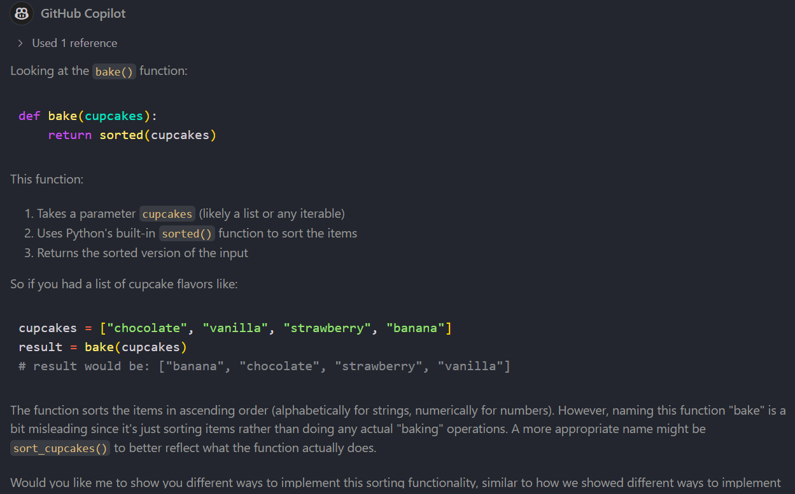

# 🧠 The Mindset Shift

Welcome to the most important ingredient in your Code without Barriers journey: **your mindset**! 🧠💡

GitHub Copilot is a powerful tool but like any good kitchen assistant, it works best when **you’re in charge**. This section is all about helping you shift from passive coding to **active learning**.

---

## 🍩 Copilot is NOT your baker

Let’s get this straight:

❌ Copilot is **not** here to bake the cupcakes for you.  
✅ Copilot is here to **help you bake better cupcakes**.

Think of it like this:
- You bring the creativity, curiosity, and control.
- Copilot brings suggestions, explanations, and shortcuts.

---

## 🧮 What is “Vibe Coding”? And why avoid it?

**Vibe Coding** is when you let Copilot write code without understanding it. You vibe with the suggestions, accept them blindly, and hope for the best.

🚫 This leads to:
- Code you can’t debug
- Features you can’t explain
- Skills you don’t develop

Instead, we want to **learn actively**.

---

## 🌟 Examples of Healthy Copilot Use

### 1. Ask GitHub Copilot the 2 million questions you'd like to ask your Senior Dev but are afraid to ask because you don't want to be seen asking dumb questions.  
[👩‍💻💥hot take: There are no dumb questions].

Here are some examples but you can ask as many as you like GitHub Copilot will never judge you or get tired*:

"Can you walk me through how this code works?"  
*Helps build a deeper understanding of logic, structure, and flow.*

"What’s the best way to structure this function or component?"  
*Encourages clean, maintainable, and scalable code practices.*

"How do I know if this code is efficient?"  
*Promotes awareness of performance, complexity, and optimization.*

"Is there a more idiomatic way to write this in [language]?"  
*Helps learn language-specific best practices and conventions.*

"How should I write a test for this code?"  
*Builds good habits around testing and quality assurance.*

"How do I debug this issue effectively?"  
*Encourages learning tools and techniques for troubleshooting.*

"What’s the difference between this approach and that one?"  
*Fosters critical thinking and comparison of coding strategies.*

"How do I handle errors or edge cases in this code?"  
*Promotes robust and resilient coding practices.*

"Can you review my code and suggest improvements?"  
*GitHub Copilot can do this in the IDE, Codespace or from a Pull Request.*

"How do I write code that’s easy for others to understand?"  
*Encourages readability, documentation, and team collaboration.*

*If GitHub Copilot 🧑‍💻 runs out of tokens 🪙 because you are using the free version, switch to another model 🤖 from the list and keep asking questions ❓. It's not tired of you 😴, it's hungry 😋.


### 2. Questions you might save for your senior Dev

**🧠 Learning & Growth**

"Can you explain why we’re doing it this way?"  
*Helps understand the reasoning behind decisions and best practices. GitHub Copilot Enterprise would have the context of your organisations codebase and all their repositories (apart from those excluded), so it would be able to answer this, if the orgs docs are good and the code practices are consistent. But it's always good to get the perspective of your Senior Dev.*

"What should I focus on learning next?"  
*Guides your learning path based on team needs and your current level. This will tell you either what your Senior Dev thinks is most important, or what they think you do not know.*

"How do I know if I’m writing good code?"  
*Encourages feedback on code quality, readability, and maintainability. GitHub Copilot will explain this to you really well, but it's good to know what your Senior Dev values and how they score code according to those metrics.*


**🛠️ Technical & Workflow**  

"What’s the best way to debug this?"  
*Builds problem-solving skills and introduces tools or techniques. You can ask GitHub Copilot this first, get it's understanding and explanations. I spoke to a Senior Dev today that told me GitHub Copilot showed him a better way to Test something and explained why his way was not as good.*

"How does this part of the system work?"  
*Deepens understanding of the codebase and architecture. GitHub Copilot can also explain this to you, but it would be useful to understand the code as your Senior Dev see's it. I think you should ask GitHub Copilot first - and then go to your Senior Dev when you mostly understand it and want their spin on it.*

"What’s the process for reviewing and merging code?"  
*Clarifies team workflows and expectations for collaboration.*

**🤝 Team & Communication**

"Who should I ask when I’m stuck?"  
*Helps avoid spinning wheels and encourages collaboration. Hopefully your Senior Dev will encourage you to come to them for help when you need to*

"How can I contribute more effectively to the team?"  
*Shows initiative and willingness to grow beyond assigned tasks.*

**✅ Feedback & Improvement**

"Can you review my code and give me feedback?"  
*Opens the door to mentorship and continuous improvement. But actually you could ask GitHub Copilot to Review your Code in the IDE and Codespace or from the Pull Request.*

"What mistakes should I watch out for?"  
*Helps avoid common pitfalls and learn from others’ experience.*

### 3. **Ask GitHub Copilot to explain code** 🐍
```python
# What does this function do?
def bake(cupcakes):
    return sorted(cupcakes)
```



### 4. Ask GitHub Copilot to explain it to you like you are 5 years old


### 5. **Ask GitHub Copilot to show you 5 different ways to solve the problem**
```python
# Method 1: Using Python's built-in sorted() function
def sort_cupcakes_builtin(cupcakes):
    return sorted(cupcakes)

# Method 2: Using bubble sort implementation
def sort_cupcakes_bubble(cupcakes):
    cupcakes = cupcakes.copy()  # Make a copy to avoid modifying original
    n = len(cupcakes)
    for i in range(n):
        for j in range(0, n - i - 1):
            if cupcakes[j] > cupcakes[j + 1]:
                cupcakes[j], cupcakes[j + 1] = cupcakes[j + 1], cupcakes[j]
    return cupcakes

# Method 3: Using list.sort() method
def sort_cupcakes_list(cupcakes):
    result = cupcakes.copy()  # Make a copy to avoid modifying original
    result.sort()
    return result

# Method 4: Using sorted() with a key function for case-insensitive sorting
def sort_cupcakes_insensitive(cupcakes):
    return sorted(cupcakes, key=str.lower)

# Method 5: Using sorted() with reverse order (descending)
def sort_cupcakes_reverse(cupcakes):
    return sorted(cupcakes, reverse=True)

# Test all implementations
if __name__ == "__main__":
    test_cupcakes = ["Vanilla", "chocolate", "Strawberry", "banana"]
    print("Sorting cupcake flavors:")
    print(f"1. Built-in sorted(): {sort_cupcakes_builtin(test_cupcakes)}")
    print(f"2. Bubble sort: {sort_cupcakes_bubble(test_cupcakes)}")
    print(f"3. List sort method: {sort_cupcakes_list(test_cupcakes)}")
    print(f"4. Case-insensitive: {sort_cupcakes_insensitive(test_cupcakes)}")
    print(f"5. Reverse order: {sort_cupcakes_reverse(test_cupcakes)}")
```

## Demo: 5 Ways to write this function

<video width="100%" style="max-width: 1200px;" controls loop muted playsinline>
  <source src="../assets/5ways.mp4" type="video/mp4">
  Your browser does not support the video tag.
</video>

