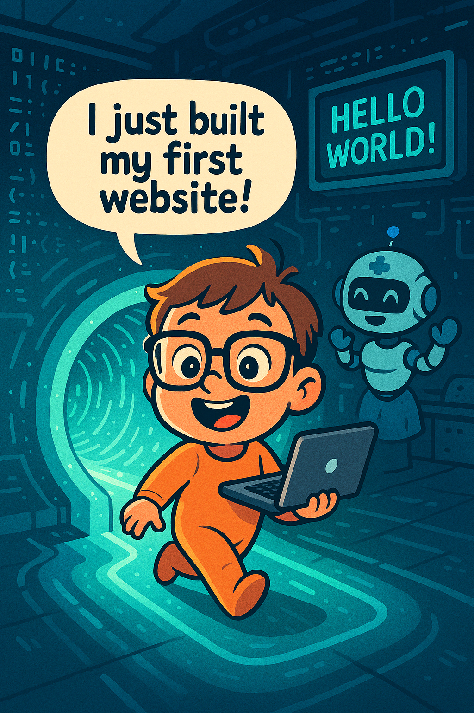

# 🎉 Wrap-Up & Resources

You did it! 💞

Now remember, despite how it seems, no-one ever walked out of the birth canal and coded their 1st website 👶💻. It takes a couple of years to learn how to walk 🚶‍♀️ and to feed yourself 🍽️, and then, not well 😅. Much longer to learn how to take care of yourself enough to be independent 🧠💪

So go easy on yourself 💖. You can learn a little bit every day 📚. When it starts to hurt your brain 🧠💥, stop. Go and drink some water 💧 and eat something 🍎. You can start again tomorrow 🌅.  

Byte-size pieces of learning 🧩 lead to larger blobs of learning taking hold in your brain 🧠✨.  

Also, I hate to say it, but Python 🐍 is not for everyone. There might be another language that makes more sense to you, to the way you process ideas 🤔. That's ok 💁‍♀️. You can try C# ⚙️ or Rust 🦀. Maybe it's JavaScript 💻 (no judgement 😄). There are many languages out there 🌍 and you shouldn't force yourself to learn one if it's not sticking.  

Have a look, GitHub Copilot 🤖 will help you. I spoke to a Senior Dev this week who told me GitHub Copilot was helping them learn Rust 🧠🦀. (All the cool developers are using it 😎)  

Never give up learning 🚀. You can write the code the world runs on 🌐, and change the way it works if you want to ✨.

### Key Takeaways:
- You’re the baker. Copilot is your sous-chef.
- Use it to learn, not to cheat.
- Ask questions. Stay curious.

### Resources:
- [GitHub Copilot Docs](https://docs.github.com/en/copilot)
- [GitHub Copilot Fundamentals](https://learn.microsoft.com/en-us/training/paths/copilot/)
- [GitHub Copilot Certification](https://learn.microsoft.com/en-us/credentials/certifications/github-copilot/?practice-assessment-type=certification)
- [Code without Barriers](https://shecodes.com.au/)

